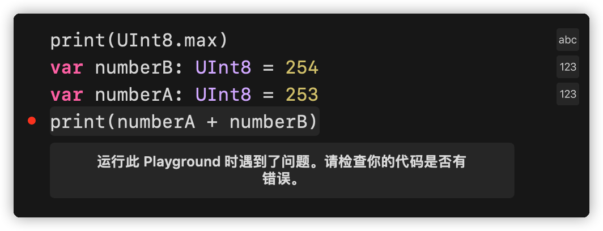
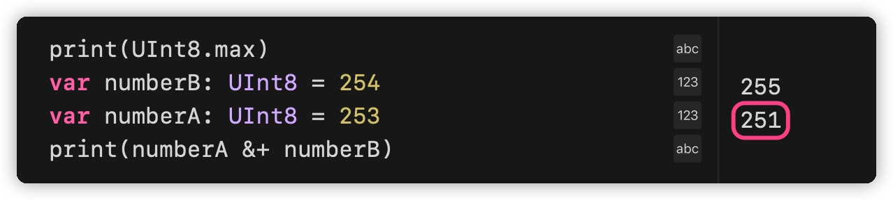
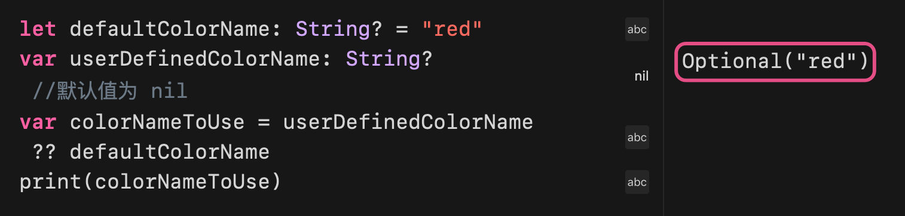

## 术语
- 一元运算符: 操作单一对象, 如: `-a`/ `!b`/ `c!`
- 二元运算符: `2 + 3`
- 三元运算符: `a ? b : c`
## 赋值运算符
```swift
let b = 10
var a = 5
a = b

// 用于元组赋值
let (x, y) = (1, 2)
// 现在 x 等于 1，y 等于 2
```
赋值运算符没有返回值 (返回一个 `Void`, 类似空的元组, `()`)
## 算术运算符
`+ - * /`加减乘除
### 注意!
> swift 不允许运算中出现溢出的情况
> 
> 所以, 想使用溢出运算, 需要使用 `a &+ b`的 "溢出运算符" (后面会讲)
> 

## 求余运算符
`var a = 9 % 4  // a = 1`
### 注意!
> `b = -9 % 4 // b = 1`
> 这里 b 应该是 -1, 但是会被去掉负号
> 所以 `(a % b) == (a % -b)`

## 一元负号运算符
`let minusThree = -three `
## 一元正号运算符
`let minusSix =-6`
`let alsoMinusSix =+minusSix // alsoMinusSix 等于 -6`
## 组合赋值运算符
`a += 2`
### 注意!
> 复合赋值运算没有返回值，`let b = a += 2`这类代码是错误。这不同于上面提到的自增和自减运算符。

## 比较运算符

- 等于 `a == b`
- 不等于 `a != b`
- 大于 `a > b`
- 小于 `a < b`
- 大于等于 `a >= b`
- 小于等于 `a <= b`
### 注意!
> Swift 也提供恒等 `===`和不恒等 `!==`这两个比较符来判断两个对象是否引用同一个对象实例.

关于元组的比较
```swift
(1, "zebra") < (2, "apple")   // true，因为 1 小于 2
(3, "apple") < (3, "bird")    // true，因为 3 等于 3，但是 apple 小于 bird
(4, "dog") == (4, "dog")      // true，因为 4 等于 4，dog 等于 dog

// 元组的比较是短路比较法则, 如第一行代码, 1 < 2 就结束了, 不会比较 zebra 和 apple
```
### 注意!
> bool 值无法被比较, 所以带有布尔类型的原则也无法被比较.
> swift 标准库只能实现七个元素以内的比较, 所以如果你的元组超过了七个元素, 需要自己实现比较方法

## 三元运算符
`a ? b : c`这个运算符等同于:
```swift
if a {
    b
} else {
    c
}
```
为了保持代码的可读性, 请不要在一行代码 / 一个计算单元中组合使用多个三元运算符.
## 空合运算符 (Nil-Coalescing Operator)
空合运算符 `a ?? b`将对可选类型 `a`进行空判断，如果 `a`包含一个值就进行解包，否则就返回一个默认值 `b`. 表达式 `a`必须是 `Optional`类型. 默认值 `b`的类型必须要和 `a`存储值的类型保持一致. 在代码层面:
```swift
a ?? b // 等同于下面
a != nil ? a! : b
```
这里的判断依然是短路逻辑, 如果 `a`不为空了, 就不会计算 `b`.
### 注意!
> a 需要是可选类型, 并且 b 的基本类型和 a 要相同, b 可以是可选类型, 但是不建议这么干
> 


## 区间运算符
### 闭合区间 ( `a...b`包含 a 和 b)
```swift
for index in 1...5 {
	print("\(index) * 5 = \(index * 5)")
}
// 1 * 5 = 5
// 2 * 5 = 10
// 3 * 5 = 15
// 4 * 5 = 20
// 5 * 5 = 25
```
### 半开放区间 ( `a..<b` 包含 a 不包含 b)
```swift
let names = ["Anna", "Alex", "Brian", "Jack"]
let count = names.count
for i in 0..<count {
	print("第 \(i + 1) 个人叫 \(names[i])")
}
// 第 1 个人叫 Anna
// 第 2 个人叫 Alex
// 第 3 个人叫 Brian
// 第 4 个人叫 Jack
```
### 单侧区间 (只指定一侧的边界)
```swift
// 针对数组
// index 2 到结尾
for name in names[2...] {
    print(name)
}
// index 开头到 2
for name in names[...2] {
    print(name)
}
// index 开头到 1, 不包括 2
for name in names[..<2] {
    print(name)
}

// 可以使用在一个非数组的环境里面, 但是必须要明确循环的边界
let range = ...5  // 相当于负无穷到 5, 严格来说是 Int64 类型的最小值到 5
range.contains(7)   // false
range.contains(4)   // true
range.contains(-1)  // true
```
## 逻辑运算符

- 逻辑非 `!a`
- 逻辑与 `a && b`
- 逻辑或 `a || b`
### 注意!
> Swift 逻辑操作符 && 和 || 是左结合的，这意味着拥有多元逻辑操作符的复合表达式优先计算最左边的子表达式。举个栗子:
> `if enteredDoorCode && passedRetinaScan || hasDoorKey || knowsOverridePassword `
> 先判断最左侧, 逻辑运算符只能判断两个元素. 所以请使用括号来优化, 明确可读性
> `if(enteredDoorCode && passedRetinaScan)|| hasDoorKey || knowsOverridePassword`

