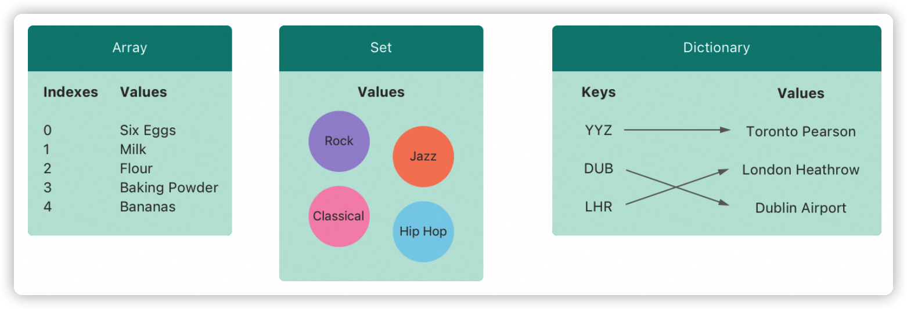
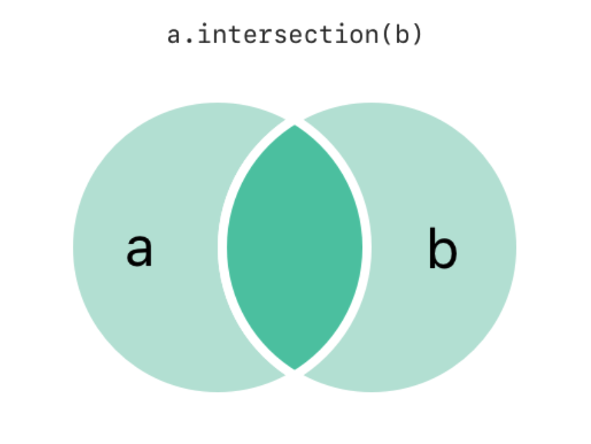
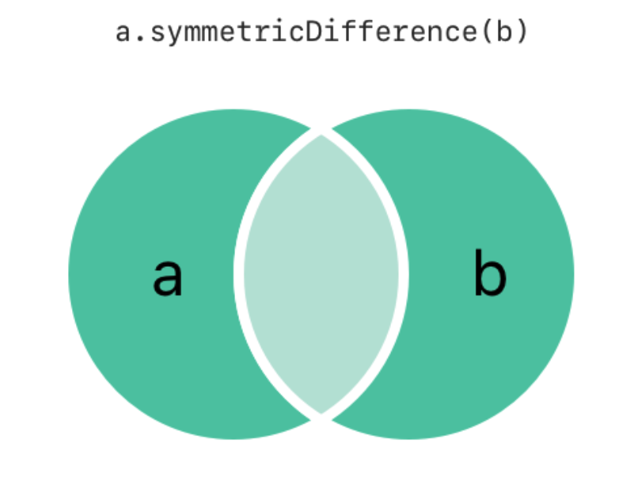
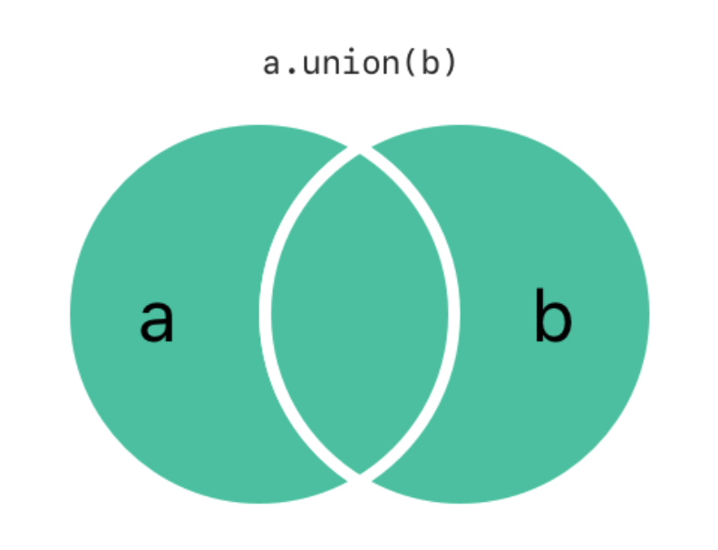
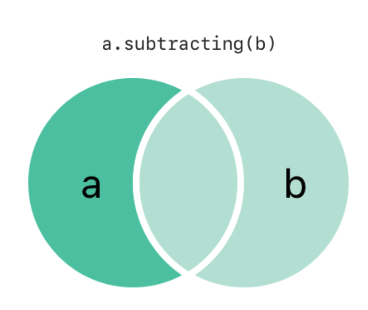
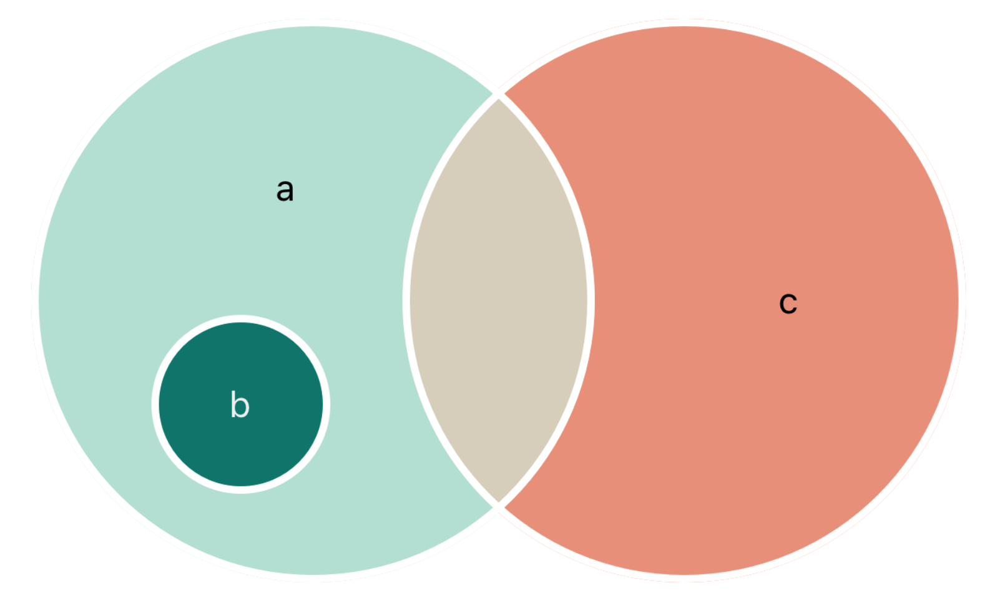

Swift 语言提供数组 `Array` / 集合 `Set`和字典 `Dictionary` 三种基本的集合类型 `Collection` 用来存储集合数据。数组是有序数据的集。集合是无序无重复数据的集。字典是无序的键值对的集。

## 注意! 
> Swift 的数组、集合和字典类型被实现为_泛型集合_。更多关于泛型类型和集合，参见 泛型 (TODO) 章节

## 集合可变性
如果创建一个数组、集合或字典并且把它分配成一个变量，这个集合将会是_可变的_。这意味着可以在创建之后添加、修改或者删除数据项。如果把数组、集合或字典分配成常量，那么它就是_不可变的_，它的大小和内容都不能被改变。
### 注意!
> 在不需要改变集合的时候创建不可变集合是很好的实践。这样做便于你理解自己的代码，也能让 Swift 编译器优化集合的性能。

## 数组
数组使用有序列表存储同一类型的多个值。相同的值可以多次出现在一个数组的不同位置中。
### 注意!
> Swift 的 `Array` 类型被桥接到 `Foundation` 中的 `NSArray` 类。


### 数组的简单语法 (语法糖)
Swift 中数组的完整写法为 `Array<Element>`，其中 `Element` 是这个数组中唯一允许存在的数据类型。也可以使用像 `[Element]` 这样的简单语法。

### 创建空数组
需要注意类型推断.
```swift
var someInts: [Int] = []
print("someInts is of type [Int] with \(someInts.count) items.")
// 打印“someInts is of type [Int] with 0 items.”

// 这里 someInts 会被推断为 Int 型的数组
someInts.append(3)
// someInts 现在包含一个 Int 值
someInts = []
// someInts 现在是空数组，但是仍然是 [Int] 类型的。
```

### 创建带有默认值的数组
```swift
var threeDoubles = Array(repeating: 0.0, count: 3)
// threeDoubles 是一种 [Double] 数组，等价于 [0.0, 0.0, 0.0]
```

### 通过两个数组相加来创建一个数组
你可以使用加法操作符 `+`来组合两个已存在的相同类型数组. 
```swift
var anotherThreeDoubles = Array(repeating: 2.5, count: 3)
// anotherThreeDoubles 被推断为 [Double]，等价于 [2.5, 2.5, 2.5]

var sixDoubles = threeDoubles + anotherThreeDoubles
// sixDoubles 被推断为 [Double]，等价于 [0.0, 0.0, 0.0, 2.5, 2.5, 2.5]
```
### 用字面量构建数组
```swift
var shoppingList: [String] = ["Eggs", "Milk"]
// shoppingList 已经被构造并且拥有两个初始项。

// 考虑到类型推断机制, 也可以这么写
var shoppingList = ["Eggs", "Milk"]
```
### 访问和修改数组
```swift
// 查看数组的长度 .count 属性
print("The shopping list contains \(shoppingList.count) items.")

// 使用 isEmpty 属性进行判空, 返回布尔值
if shoppingList.isEmpty {
    print("The shopping list is empty.")
} else {
    print("The shopping list isn't empty.")
}
// 输出 "The shopping list isn't empty."

// 使用 append 方法向数组的尾部追加一个元素
shoppingList.append("Flour")
// 此后数组包含三个元素

// 也可以使用 += 运算符进行元素的追加
shoppingList += ["Baking Powder"]
// shoppingList 现在有四项了
shoppingList += ["Chocolate Spread", "Cheese", "Butter"]
// shoppingList 现在有七项了

// 可以直接使用下标来进行元素的引用
var firstItem = shoppingList[0]
// 第一项是“Eggs”
shoppingList[0] = "Six eggs"
// 其中的第一项现在是“Six eggs”而不是“Eggs”

// 通过元素的索引范围来操作, 增加或者减少元素
shoppingList[4...6] = ["Bananas", "Apples"]
// shoppingList 现在有6项
```
#### 注意!
> 在 swift 中, 针对数组元素进行索引使用的时候, 如果元素不存在则会引发运行时错误, 比如数组有 5 个元素, 索引为 0 ~ 4, 则你想用 `数组[5] = "新鲜值"` 这种方式来进行元素的追加是会失败的 (运行时错误).

```swift
// 使用 insert 方法来进行元素的插入, 签名: insert(_:at:)
shoppingList.insert("Maple Srupe", at: 0)

// 使用 remove 方法来进行元素的移除, 签名: remove(at:), 同时返回这个移除值
let Maple_syrup = shoppingList.remove(at: 0)
// 移除之后后面的元素会自动前移补齐缺口
let firstInTheList = shoppingList[0] // six eggs

// 还可以使用 removeLast 方法来移除最后一个元素, 同时返回这个元素
let apples = shoppingList.removeLast()
```

### 数组遍历
可以使用 `for-in` 循环来进行数组的遍历
```swift
for item in shoppingList {
    print(item)
}
// Six eggs
// Milk
// Flour
// Baking Powder
// Bananas
```
如果你需要使用到元素的索引, 请使用 `enumerated`方法进行遍历, 此方法返回一个包含索引和数值本身的元组
```swift
for (index, value) in shoppingList.enumerated() {
    print("Item \(index + 1): \(value)")
}
// Item 1: Six eggs
// Item 2: Milk
// Item 3: Flour
// Item 4: Baking Powder
// Item 5: Bananas
```
## 集合
集合 `set`用来存储 ==同类型== 的 ==无顺序== 且 ==不相同==  (distinct) 的数据.
### 集合类型的哈希值
存储在 set 中的数据必须是可哈希的, 即: `a == b`则等同于 `a.hashValue == b.hashValue`
### Set 类型语法
`Set<Element>`使用这种形式来定义一个集合 (就是个泛型)
### 创建并初始化一个空的 Set
```swift
var letters = Set<Character>()
print("letters is of type Set<Character> with \(letters.count) items.")
// Prints "letters is of type Set<Character> with 0 items."
```
对于这个集合的操作:
```swift
letters.insert("a")
// letters 现在含有1个 Character 类型的值
letters = []
// letters 现在是一个空的 Set，但是它依然是 Set<Character> 类型
```
### 用数组字面量创建集合
你可以通过数组字面量创建一个集合:
```swift
var favoriteGenres: Set<String> = ["Rock", "Classical", "Hip hop"]
// favoriteGenres has been initialized with three initial items
```

集合 `favouriteGenres` 被初始化为一个有三个值的集合, 如果使用一个字面量数组来初始化集合, 并且集合成员类型和数组成员类型相同, 则通过类型推断可以不显式的写集合的类型:
```swift
var favoriteGenres: Set = ["Rock", "Classical", "Hip hop"]
```

### 访问和修改集合
* 使用 `count` 属性获取集合的元素个数:

```swift
print("I have \(favoriteGenres.count) favorite music genres.")
```

* 使用 `isEmpty` 属性 (返回一个布尔值) 来判断是否为空

```swift
if favoriteGenres.isEmpty {
    print("As far as music goes, I'm not picky.")
} else {
    print("I have particular music preferences.")
}
```

* 通过调用 `insert(_:)` 方法来插入元素

```swift
favoriteGenres.insert("Jazz")
// favoriteGenres 现在包含4个元素
```

* 通过调用 `remove(_:)` 方法来删除元素, 如果这个元素存在, 则返回元素本身, 否则返回 nil
* 通过调用 `removeAll()` 方法来移除集合全部元素
* 通过使用 `contains(_:)` 方法来判断集合是否包含一个元素

```swift
if favoriteGenres.contains("Funk") {
    print("I get up on the good foot.")
} else {
    print("It's too funky in here.")
}
// 打印“It's too funky in here.”
```

### 遍历一个集合
* 使用 `for-in` 循环来遍历集合:
```swift
for genre in favoriteGenres {
    print("\(genre)")
}
// Classical
// Jazz
// Hip hop
```
* `set` 类型没有顺序, 使用 `sorted()` 方法来返回一个有序数组, 排序原则为 `<` 从小到大
```swift
for genre in favoriteGenres.sorted() {
    print("\(genre)")
}
// Classical
// Hip hop
// Jazz
```


## 集合操作
### 集合基本惭怍
* 使用 intersection(_:) 方法根据两个集合的交集创建一个新的集合。


* 使用 symmetricDifference(_:) 方法根据两个集合不相交的值创建一个新的集合。


* 使用 union(_:) 方法根据两个集合的所有值创建一个新的集合。


* 使用 subtracting(_:) 方法根据不在另一个集合中的值创建一个新的集合。


### 集合成员关系和相等

* 相等: 使用“是否相等”运算符（==）来判断两个集合包含的值是否全部相同。`a == b // false`
* 子集: 使用 isSubset(of:) 方法来判断一个集合中的所有值是否也被包含在另外一个集合中。`b.isSubset(of:a) // true`
* 超集: 使用 isSuperset(of:) 方法来判断一个集合是否包含另一个集合中所有的值。`a.isSuperset(of:b) // true`
* 使用 isStrictSubset(of:) 或者 isStrictSuperset(of:) 方法来判断一个集合是否是另外一个集合的子集合或者父集合并且两个集合并不相等。
```swift
a.isStrictSuperset(of:b) // true
// 等同于
if (a != b) && (a.isSuperset(of:b)) {
    // true
}
```
* 使用 isDisjoint(with:) 方法来判断两个集合是否不含有相同的值（是否没有交集）。`b.isDisjoint(with:c) // true`

## 字典
`Dictionary` 类型, KV 组合类型, key 需要是相同类型, 且为 `Hashable` , value 也是相同类型.
### 字典类型简单语法
Swift 的字典使用 `Dictionary<Key, Value>` 定义, 也可简化为: `[Key: Value]`
### 创建空字典
```swift
var namesOfIntegers: [Int: String] = [:]
// namesOfIntegers 是一个空的 [Int: String] 字典
namesOfIntegers[16] = "sixteen"
// namesOfIntegers 现在包含一个键值对


// 注意: 通过 [:] 置空不影响字典本身的 kv 类型
namesOfIntegers = [:]
// namesOfIntegers 又成为了一个 [Int: String] 类型的空字典
```
### 用字典字面量创建字典
```swift
var airports: [String: String] = ["YYZ": "Toronto Pearson", "DUB": "Dublin"]

// 也可以直接使用类型推断, 省略类型生命
var airports = ["YYZ": "Toronto Pearson", "DUB": "Dublin"]
```
### 访问和修改字典

* 可以通过 `Dictionary` 的只读属性 `count` 来获取字典的数据项数量
```swift
print("The dictionary of airports contains \(airports.count) items.")
// 打印“The dictionary of airports contains 2 items.”（这个字典有两个数据项）
```
* 使用布尔属性 `isEmpty` 作为一个缩写形式去检查 `count` 属性是否为 0
```swift
if airports.isEmpty {
    print("The airports dictionary is empty.")
} else {
    print("The airports dictionary is not empty.")
}
// 打印“The airports dictionary is not empty.”
```
* 使用下标来增加新的 key / value, 或者修改这个 key 的值, 等同于使用 `updateValue(_:forKey:)` 方法:

```swift
airports["LHR"] = "London"
// airports 字典现在有三个数据项

// 注意: updateValue 方法会返回修改前的原始值, 如果不存在这个 key, 会返回 nil
if let oldValue = airports.updateValue("Dublin Airport", forKey: "DUB") {
    print("The old value for DUB was \(oldValue).")
}
// 输出“The old value for DUB was Dublin.”

// 使用下标来进行方案和判断, 效果相同:
if let airportName = airports["DUB"] {
    print("The name of the airport is \(airportName).")
} else {
    print("That airport is not in the airports dictionary.")
}
// 打印“The name of the airport is Dublin Airport.”
```
* 通过将一个 key 设定为 nil 来删除一个 kv 对, 或者使用 `removeValue(forkey:)` 这个方法

```swift
airports["APL"] = "Apple Internation"
// “Apple Internation”不是真的 APL 机场，删除它
airports["APL"] = nil
// APL 现在被移除了

// removeValue 方法在键值对存在的情况下会移除该键值, 对并且返回被移除的值, 或者在没有对应值的情况下返回 nil
if let removedValue = airports.removeValue(forKey: "DUB") {
    print("The removed airport's name is \(removedValue).")
} else {
    print("The airports dictionary does not contain a value for DUB.")
}
// 打印“The removed airport's name is Dublin Airport.”
```

### 字典遍历
* 使用 for-in 循环来遍历某个字典中的键值对, 返回 k-v 元组

```swift
for (airportCode, airportName) in airports {
    print("\(airportCode): \(airportName)")
}
// YYZ: Toronto Pearson
// LHR: London Heathrow
```
* 通过 `keys` 或者 `values` 属性返回全部的 key 和 value 进行遍历
  
```swift
for airportCode in airports.keys {
    print("Airport code: \(airportCode)")
}
// Airport code: YYZ
// Airport code: LHR

for airportName in airports.values {
    print("Airport name: \(airportName)")
}
// Airport name: Toronto Pearson
// Airport name: London Heathrow

// 也可以将这个属性实例化为一个数组进行操作
let airportCodes = [String](airports.keys)
// airportCodes 是 ["YYZ", "LHR"]

let airportNames = [String](airports.values)
// airportNames 是 ["Toronto Pearson", "London Heathrow"]

// 注意: Swift 的 Dictionary 是无序集合类型。
// 为了以特定的顺序遍历字典的键或值，可以对字典的 keys 或 values 属性使用 sorted() 方法。
```