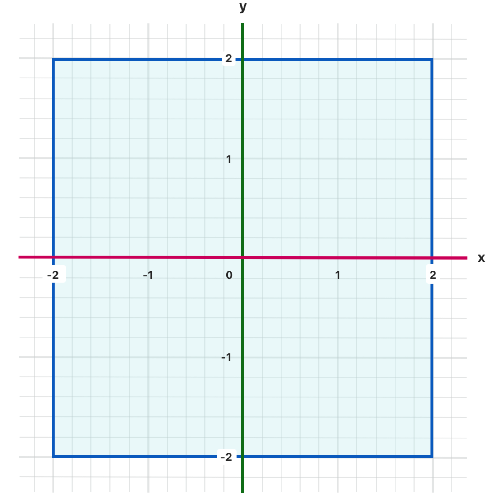
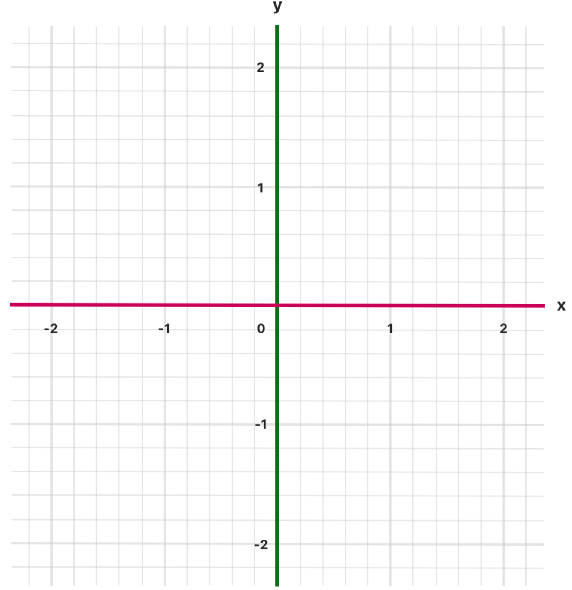
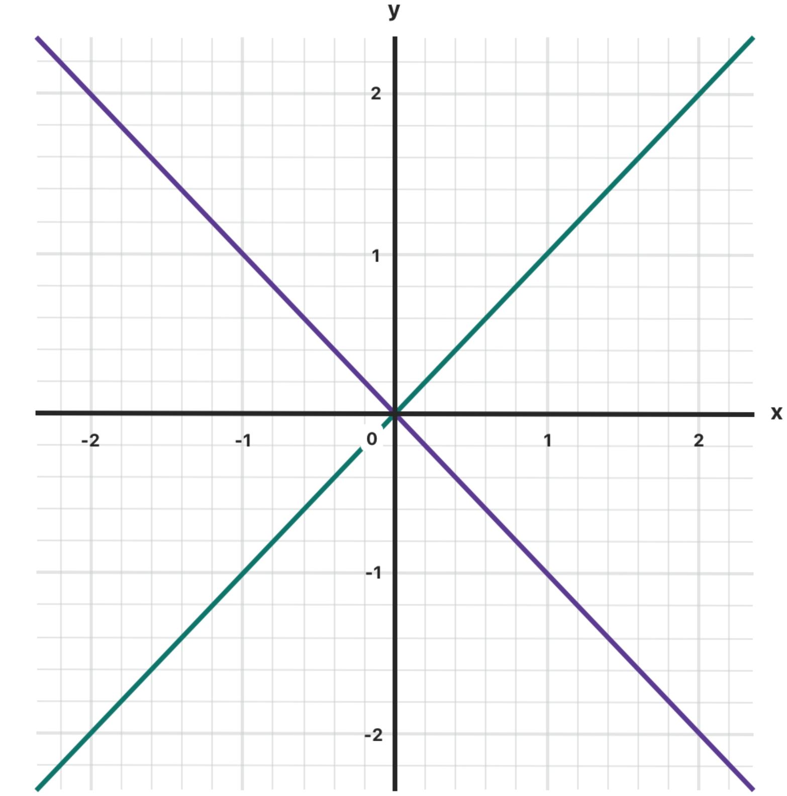

# 控制流

基础控制流包括: 
* `while` 循环
* 条件分支的 `if` / `guard` 和 `switch` 语句
* 配套的控制流程跳转到其他代码位置的 `break` 和 `continue` 语句
* 以及 `for-in` 循环用来更简单地遍历数组 / 字典 / 区间 / 字符串和其他序列类型。

## for-in 循环
```swift
// 遍历数组
let names = ["Anna", "Alex", "Brian", "Jack"]
for name in names {
    print("Hello, \(name)!")
}

// 遍历字典
let numberOfLegs = ["spider": 8, "ant": 6, "cat": 4]
for (animalName, legCount) in numberOfLegs {
    print("\(animalName)s have \(legCount) legs")
}

// 遍历数字范围
for index in 1...5 {
    print("\(index) times 5 is \(index * 5)")
}

// 可以忽略循环中的单个迭代容器的命名:
let base = 3
let power = 10
var answer = 1
for _ in 1...power {
    answer *= base
}
print("\(base) to the power of \(power) is \(answer)")
// 输出“3 to the power of 10 is 59049”

// 在使用范围做循环的时候, 可以使用 stride 方法来按照一个规则进行对应范围的生成
let minutes = 60
let minuteInterval = 5
// 使用 from ... to 这种方法不包括最后的 to 的边界
for tickMark in stride(from: 0, to: minutes, by: minuteInterval) {
    // 每5分钟渲染一个刻度线（0, 5, 10, 15 ... 45, 50, 55）
}

// 如果需要包含边界, 可以使用 from ... through 的签名组合
let hours = 12
let hourInterval = 3
for tickMark in stride(from: 3, through: hours, by: hourInterval) {
    // 每3小时渲染一个刻度线（3, 6, 9, 12）
}
```

## while 循环

`while` 循环: 先判断条件, 符合条件的进行循环体的执行
`repeat - while` 循环: 先执行循环体一次, 然后判断是否符合条件, 进入下个循环

### while
```swift
while condition {
	statements
}
```

### repeat - while
```swift
repeat {
	statements
} while condition
```

## 条件语句
### if
条件为 `true` 的时候执行语句, 支持后面使用 `else` 作为条件从句, 还可支持嵌套
```swift
temperatureInFahrenheit = 90
if temperatureInFahrenheit <= 32 {
    print("It's very cold. Consider wearing a scarf.")
} else if temperatureInFahrenheit >= 86 {
    print("It's really warm. Don't forget to wear sunscreen.")
} else {
    print("It's not that cold. Wear a t-shirt.")
}
// 输出“It's really warm. Don't forget to wear sunscreen.”
```

### switch
* 每一个条件都需要一个 `case` 与之匹配, 取分大小写 'a' 和 "A", 如果漏掉了会有运行时错误
* `case` 内不需要放置 `break`
* `default` 分支用来承接除了列出的 case 之外的剩余匹配可能, 这个分支需要在最后面
* 不存在隐式贯穿, 即: 执行完了一条 case 就退出这个 switch 块, 但是依然可以使用 break 来提前结束判断分支
```swift
let someCharacter: Character = "z"
switch someCharacter {
case "a":
    print("The first letter of the alphabet")
case "z":
    print("The last letter of the alphabet")
default:
    print("Some other character")
}
// 输出“The last letter of the alphabet”
```
* 支持区间匹配
```swift
let approximateCount = 62
let countedThings = "moons orbiting Saturn"
let naturalCount: String
switch approximateCount {
case 0:
    naturalCount = "no"
case 1..<5:
    naturalCount = "a few"
case 5..<12:
    naturalCount = "several"
case 12..<100:
    naturalCount = "dozens of"
case 100..<1000:
    naturalCount = "hundreds of"
default:
    naturalCount = "many"
}
print("There are \(naturalCount) \(countedThings).")
// 输出“There are dozens of moons orbiting Saturn.”
```
* 支持元组匹配
  如下图的坐标点的分类匹配问题
  
```swift
let somePoint = (1, 1)
switch somePoint {
case (0, 0):
    print("\(somePoint) is at the origin")
case (_, 0): // 使用 _ 作为条件忽略
    print("\(somePoint) is on the x-axis")
case (0, _):
    print("\(somePoint) is on the y-axis")
case (-2...2, -2...2): // 元组里的单个元素支持范围匹配
    print("\(somePoint) is inside the box")
default:
    print("\(somePoint) is outside of the box")
}
// 输出“(1, 1) is inside the box”
```
> 注意:
> 不像 C 语言，Swift 允许多个 case 匹配同一个值。
> 实际上，在这个例子中，四个 case 都可以匹配点 (0, 0) 。
> 但是，如果存在多个匹配，==那么只会执行第一个被匹配到的 case 分支。==
> 考虑点 (0, 0)会首先匹配 case (0, 0)，因此剩下的能够匹配的分支都会被忽视掉。

* 值绑定 (value bindings)
  允许在 case 语句中将判断匹配的值绑定到一个临时变量 / 常量来使用
  

```swift
let anotherPoint = (2, 0)
switch anotherPoint {
case (let x, 0): // 绑定了 y = 0 的时候的 x 坐标的值
    print("on the x-axis with an x value of \(x)")
case (0, let y): // 同前
    print("on the y-axis with a y value of \(y)")
case let (x, y): // 绑定了两个都不为 0 的时候坐标值
    print("somewhere else at (\(x), \(y))")
}
// 输出 “on the x-axis with an x value of 2”
```
* 可以在 `case` 分支中判断使用 `where` 条件语句辅助判断
  例如: 使用代码判断分类坐标点
  
```swift
let yetAnotherPoint = (1, -1)
switch yetAnotherPoint {
    case let (x, y) where x == y:
        print("(\(x), \(y)) is on the line x == y")
    case let (x, y) where x == -y:
        print("(\(x), \(y)) is on the line x == -y")
    case let (x, y):
        print("(\(x), \(y)) is just some arbitrary point")
}
// 输出“(1, -1) is on the line x == -y”
```
* 复合型 case: 可以在一个 case 条件中使用多个条件
```swift
let someCharacter: Character = "e"
switch someCharacter {
case "a", "e", "i", "o", "u":
    print("\(someCharacter) is a vowel")
case "b", "c", "d", "f", "g", "h", "j", "k", "l", "m",
     "n", "p", "q", "r", "s", "t", "v", "w", "x", "y", "z":
    print("\(someCharacter) is a consonant")
default:
    print("\(someCharacter) is not a vowel or a consonant")
}
// 输出“e is a vowel”

// 注意 这里的复合类型同样支持进行值绑定
let stillAnotherPoint = (9, 0)
switch stillAnotherPoint {
case (let distance, 0), (0, let distance):
    print("On an axis, \(distance) from the origin")
default:
    print("Not on an axis")
}
// 输出“On an axis, 9 from the origin”
```

## 控制转移语句
swift 包含有五个控制转移语句: `continue` / `break` / `fallthrough` / `return` (在 "函数" 章节讲述) / `throw` (在 "异常" 章节讲述)

### continue
`continue` 语句告诉一个循环体立刻停止本次 ==循环== ，重新开始下次循环。
```swift
// 删除元音和空格
let puzzleInput = "great minds think alike"
var puzzleOutput = ""
for character in puzzleInput {
    switch character {
    case "a", "e", "i", "o", "u", " ":
        continue
    default:
        puzzleOutput.append(character)
    }
}
print(puzzleOutput)
    // 输出“grtmndsthnklk”
```

### break
`break` 语句会立刻结束整个控制流的执行.
* break in 循环: 直接跳出并且结束循环
* break in switch: 跳出当前判断, 开始执行 switch 块之后的语句
  > 注意
  > 针对 case 语句中, 如果没有任何可执行的语句, 例如只有注释, 会产生一个编译期错误
  > 请使用 break 语句来表示忽略某个 switch 的 case 分支
```swift
let numberSymbol: Character = "三"  // 简体中文里的数字 3
var possibleIntegerValue: Int?
switch numberSymbol {
case "1", "١", "一", "๑":
    possibleIntegerValue = 1
case "2", "٢", "二", "๒":
    possibleIntegerValue = 2
case "3", "٣", "三", "๓":
    possibleIntegerValue = 3
case "4", "٤", "四", "๔":
    possibleIntegerValue = 4
default:
    break
}
if let integerValue = possibleIntegerValue {
    print("The integer value of \(numberSymbol) is \(integerValue).")
} else {
    print("An integer value could not be found for \(numberSymbol).")
}
// 输出“The integer value of 三 is 3.”
```
### fallthrough
* 使用 `fallthrough` 关键字来显式的指定一条 case 语句中从 fallthrough 处进入到下一个匹配块.
* 注意: 如果 case 语句块中 `fallthrough` 关键字后面仍有代码, ==这些代码不会被执行==

### 带标签语句
* swift 语言中可以通过使用 `lable_name: 语句` 的形式来为一行代码指定代名词, 用来执行指定的语句或者区别于其它代码, 防止语言歧义.
如下的代码片段来展示用处
```swift
gameLoop: while square != finalSquare {
    diceRoll += 1
    if diceRoll == 7 { diceRoll = 1 }
    switch square + diceRoll {
    case finalSquare:
        // 骰子数刚好使玩家移动到最终的方格里，游戏结束。
        break gameLoop
    case let newSquare where newSquare > finalSquare:
        // 骰子数将会使玩家的移动超出最后的方格，那么这种移动是不合法的，玩家需要重新掷骰子
        continue gameLoop
    default:
        // 合法移动，做正常的处理
        square += diceRoll
        square += board[square]
    }
}
print("Game over!")
```

## 提前退出
像 `if` 语句一样，`guard` 的执行取决于一个表达式的布尔值。我们可以使用 `guard` 语句来要求条件必须为真时，以执行 `guard` 语句后的代码。不同于 `if` 语句，一个 `guard` 语句总是有一个 `else` 从句，如果条件不为真则执行 `else` 从句中的代码。
```swift
func greet(person: [String: String]) {
    guard let name = person["name"] else {
        return
    }

    print("Hello \(name)!")

    guard let location = person["location"] else {
        print("I hope the weather is nice near you.")
        return
    }

    print("I hope the weather is nice in \(location).")
}

greet(person: ["name": "John"])
// 输出“Hello John!”
// 输出“I hope the weather is nice near you.”
greet(person: ["name": "Jane", "location": "Cupertino"])
// 输出“Hello Jane!”
// 输出“I hope the weather is nice in Cupertino.”
```
* 通常使用 `guard` 来确保一个条件为真, 否则就在后面的 `else` 从句里面退出, 以保证强可靠性, 提升代码的可读性
* 退出常用的方法为 `return` / `continue` / `break` / `throw`

## 检测 API 可用性
* swift 内置支持检查 API 版本方法: available
```swift
if #available(iOS 10, macOS 10.12, *) {
    // 在 iOS 使用 iOS 10 的 API, 在 macOS 使用 macOS 10.12 的 API
} else {
    // 使用先前版本的 iOS 和 macOS 的 API
}
```
> 以上可用性条件指定，if 语句的代码块仅仅在 iOS 10 或 macOS 10.12 及更高版本才运行。
> 最后一个参数，*，是必须的，用于指定在所有其它平台中，如果版本号高于你的设备指定的最低版本，if 语句的代码块将会运行。
* 还可以通过不可用性来进行检测:
```swift
if #available(iOS 10, *){
} else {
	//回滚代码
}
if #unavailable(iOS 10) {
	//回滚代码
}
```