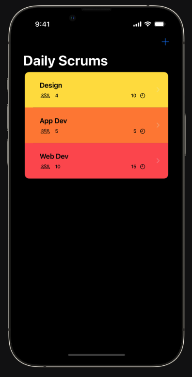
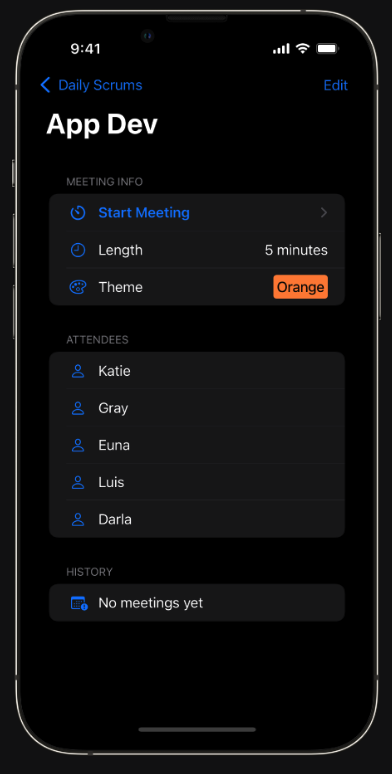
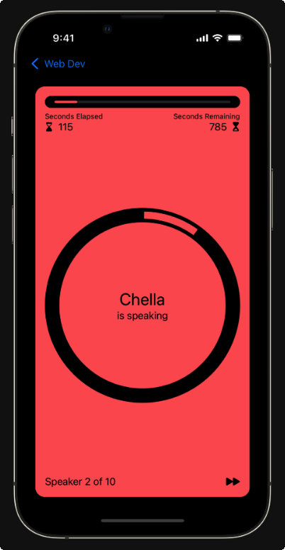

# 从 Scrumdinger 开始
 
 > 通过编写一个全功能的 iOS app 来学习使用 SwiftUI 框架
 > 开始本部分之前, 请了解技术背景需求, SwiftUI 背后的关键理念, 以及你要编写的 app

 ## 关于此模块
 
 这个教程是为有一定的经验但是新接触 swiftUI 的开发者准备的, 需要你花点时间先了解 swift 的语法, 数据类型, 语法细节等等, 例如: `optionals 可选类型`, 以及 SwiftUI 经常会使用到的 `closures 闭包`

 ## SwiftUI 概览

 swiftUI 是一个为 Apple 全平台构建 app 的声明式框架, 你可以通过使用 swiftUI 和单一的语言加上通用 API 来定义一个 app 的 UI 和行为. 

 关注以下细节, 可以更加快速更加高质量的构建一个 app:
 * 声明式语法 – 使用简单的 Swift 结构体定义屏幕上显示的视图. 你的视图会自动保持最新. 
 * 组合式 API – 使用内置视图和修饰符快速创建和迭代你的 UI. 通过组合简单视图来组成更复杂的视图. 
 * 强大的布局系统 – 当现有的视图和控件不适合你的需要时, 您可以自己绘制. 
 * 反映应用程序数据的视图 – 定义视图的数据依赖关系, SwiftUI 在数据更改时自动更新视图, 避免无效视图状态的错误.
 * 自动辅助功能支持 – SwiftUI 添加了基本的辅助功能, 后续你将学会以最小的努力来增强这些辅助功能. 

 ## 了解要写的 app

 许多软件工程团队使用日会 (称为 Scrum) 来计划他们当天的工作. Scrums 是简短的会议, 每位与会者在会议中讨论他们昨天完成的工作 / 今天的工作以及可能影响他们工作的任何障碍. 本模块将指导您完成 Scrumdinger 的开发, Scrumdinger 是一款帮助用户管理日常 Scrum 的 iOS 应用程序. 为了帮助保持 scrum 简短和集中, Scrumdinger 使用视觉和音频提示来指示每个与会者应该发言的时间和时长. 该应用程序还会显示一个进度屏幕, 显示会议的剩余时间, 并创建一份供用户稍后参考的纪要. 以下是你将在此模块中构建的内容的详细信息: 
 
 ### Scrum 列表
 该应用程序的主屏幕显示了每个用户每日站会的摘要. 用户可以点击列表中的一行来查看 scrum 的详细信息, 或者通过点击导航栏中的添加 (+) 按钮来创建新的 scrum.
 
 ### Scrum 细节和编辑能力
 Scrum 详情页的视图显示有关 Scrum 的更多信息, 包括每个与会者的姓名和以前会议的列表. 用户可以通过点击 "编辑" 按钮来修改 Scrum 的任何属性. 编辑屏幕包括一个选择器 (picker) 来确定哪个用户可以更改每个会议的颜色主题. 点击列表顶部的 "开始会议" 按钮可启动新的会议计时器. 
 
 ### 会议计时器
 会议计时器顶部的进度条显示会议的已用时间和剩余时间. 该应用程序在屏幕中央显示当前发言人的姓名, 并在屏幕底部显示一个按钮以前进到下一位发言人. 圆形进度环中的分段代表每个与会者. 当与会者用完所有时间时, Scrumdinger 会播放 "叮" 的提示音并向环中添加一个新分段. 会议进度时环满了之后则会议结束. 

 ## 成功秘诀
 * 边做边学. 每个教程都包括入门项目和已完成的项目. 打开起始项目并完成教程中的每个步骤. 
 * 在学习中发挥积极作用. 阅读每个步骤并在查看代码差异之前考虑如何完成给定的任务. 
 * 确保安装最新版本的 Xcode.
 ## 是时候开始了
 现在您已经看到了 Scrumdinger, 是时候构建它了. 如果您遇到困难, 请不要担心. 您可以在完成教程时查看每个步骤的代码差异, 也可以下载并在 Xcode 中查看已完成的项目. 您还可以访问 Apple Developer Forums 以获得有关各种开发主题的帮助. 
