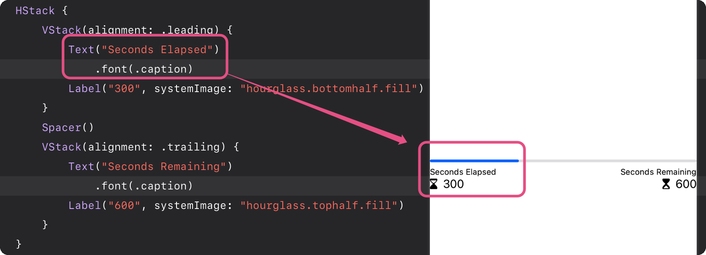

# 使用栈 (Stacks) 来布局视图

使用 SwiftUI 声明性语法创建 / 修改和组合视图以组成应用程序的 UI, 你将开始构建 Scrumdinger，这是一个管理会议的应用程序, 通过排列视图组来创建会议计时器屏幕. 随着您逐步学习该模块, 您将在完成最终设计时重新访问计时器屏幕. 

按照以下步骤开始您的新项目，或打开完成的项目并自行探索代码.

[工程代码](https://docs-assets.developer.apple.com/published/97f26bbb7d93c4a8adca34fa09b26ee5/UsingStacksToArrangeViews.zip)
[Xcode 13](https://apps.apple.com/us/app/xcode/id497799835?mt=12)


## 第一部分 创建工程
在本模块中，您将通过创建 Scrumdinger 学习应用程序开发的基本知识。 在向应用程序添加新功能时，您将探索 Xcode 和 SwiftUI 的基础知识。 在本节中，您将为 Scrumdinger 创建 Xcode 项目。


1. 通过 iOS app 模板创建新的 iOS app 工程
   

2. 在工程设置中, 命名产品名字为 "Scrumdinger", 在界面 (Interface) 下拉框选则 SwiftUI. 模板包含了一个起始文件, 包含 app 的初始视图: `ContentView.swift`, 一个定义了 app 入口点的文件: `ScrumdingerApp.swift`. 

3. 选择一个地方来保存你的工程:
   

## 第二部分 创建视图组(Groups of Views)
视图定义了 UI 的一部分。 它们是您应用程序的构建基石。 您可以通过将小的、简单的视图组合起来来构建复杂的视图。 在本节中，您将构建计时器屏幕的标题 (header) 以显示会议的已用时间和剩余时间。

* 番外: SwiftUI 中有三种 Stack, 分别是 VStack(垂直栈) / HStack (水平栈) / ZStack (前后栈), 后面回详细的讲

1. 打开 `ContentView.swift` 默认的 SwiftUI 视图文件声明了两个结构体。 第一个结构体遵循 View protocol，它只有一个要求：一个 body 属性 返回一个 View。 在 body 属性中，您描述了视图的内容、布局和 View 的行为。 第二个结构体声明该视图在画布上显示的预览。
   
   接下来我们重构 `ContentView.swift` 为其指定一个名称

2. 右键点击 `ContentView` 结构体, 选择 "Refactor > Rename", 将其重命名为 `MeetingView`
   
   为保持命名的一致性, 同时也可以把预览视图的结构体也改名成为 `MeetingView_Previews`

3. 使用一个 `ProgressView` 替换现有 body 中存在的内容, 并且用占位数据来初始化当前视图
   
   您将使用进度视图来显示 Scrum 期间所用时间的百分比。 进度视图还可以显示不确定的进度，例如应用加载数据的时间。

4. 在 xcode 的画布部分点击 'Resume' 来展示预览. 当您在项目导航器中选择一个 SwiftUI 文件时，画布会与编辑器一起打开。 画布会向您显示视图运行时的预览。
   

5. 按住 `cmd` 点击 `ProgressView` 并且选择 'Embed in VStack' (嵌入到 VStack). 栈 (Stacks) 按照水平 (horizontally) / 垂直 (vertically) / 前后 (back to front) 来分组视图, 你可以使用它来组合或者分层你的 view 组件.
   

6. 在代码中创建一个水平栈 (HStack), 点击 Library 按钮, 拖进来一个 text view 到这个 HStack 中, 将它的值改为 "Secndes Elapsed". 图片请参考上图👆🏻
   
7. 添加另外一个 text view, 内容为 "Seconds Remaining".
   

8. 嵌入到两个不同的 VStack:
   ```swift
   HStack {
        VStack {
            Text("Seconds Elapsed")
        }
        VStack {
            Text("Seconds Remaining")
        }
    }
   ```

9.  在第一个 texe view 下面添加一个 `label`, 它的 `title` 是 300, `systemImage` 参数是 "hourglass.bottomhalf.fill"
    
    注意: 这里的这个系统图片来源自[苹果官方 SF Symbols](https://developer.apple.com/sf-symbols/) 系统, 是苹果系统集成的符号集, 其中的符号会被当做字体来对待, 因此可以进行动态无损缩放, 适配不同的系统分辨率.

10. 在第二个 text view 下面添加一个 `label`, 它的 `title` 是 600, `systemImage` 参数是 "hourglass.tophalf.fill"
    

## 第三部分 视图修改与风格化

现在我们已经创建了最基础的视图, 包括header, 接下来设计会议剩余时间计时器的原型, 并且进行风格化, 在这里你会添加内置的风格修饰器 (modifiers) 用以调整 header 部分的样式, 同时还会添加新的 stacks 和 views, 并且开始添加控制部分.


1. 在两个 text view 所在的 `VStack` 之间增加分隔 (spacer)
   
   

2. 在 `VStack` 中添加针对 second elapsed 的前导对齐 (leading alignment) / 左对齐 和针对 seconds remaining 的尾对齐 (trailing alignment) / 右对齐, 如图: 
   
   注意: 默认的对齐是中心对齐 (center alignment), 修饰符会 override 原有的默认行为. 
   你也可以通过选择 VStack, 在属性观察器 (Attributes inspector) 里面的对齐选项 (Alignment Options) 里面修改对齐方式 

3. 给 text view 添加 `.font(.caption)` 样式来减小字体

   
   想要定制 SwiftUI 的视图, 请调用名为 修饰器 (modifiers) 的方法, 每个方法返回一个新的 view, 可以在一个单独的 view 上使用多个修饰器, 要使用链式修饰器, 请垂直的堆叠它们.

> 现在完成了 header 的基本样式构建, 接下来给圆环型的进度条一个占位

4. 添加一个带边框的圆环来占位, 后面来替换这个圆环的占位, 弄一个正儿八经的原型计时器上去, 就是在你的 `VStack` 里面增加一个 `Circle()`
   

> 再搞一个 footer 来完成整个的原型设计

5. 在你的 `VStack` 里面增加一个 `HStack`
   

6. 给 footer 添加一个快进按钮添加一个图片作为它的 label
   

7. 给 footet 的文字和按钮增加 `spacer`, 注意这里增加之后会让整个布局发生变化, `spacer` 会自动填满整个 `HStack`.
   

8. 给整个最外层 (top-level)  `VStack` 添加填充属性, 防止贴边, 注意观看变化
   

## 第四部分 补充无障碍访问数据

SwiftUI 具有内置无障碍辅助功能，因此您只需很少的额外工作即可获得无障碍辅助功能支持。 例如，文本视图中的字符串内容可以自动支持 VoiceOver 等设备功能。 但有时，您可能希望补充系统推断的数据以增强用户的无障碍可访问性体验。


> 默认情况下, VoiceOver 从图片的 header 属性获取它的系统名称: hourglass.bottomhalf.fill and hourglass.tophalf.fill.
> (增补: 所以你的命名应当具备可读性, 残障人士获取系统信息是靠这些数据来传达的, 当然更好的方式是给他一个更加简洁易懂的名称)


1. 显式的忽略 header 中 `HStack` 中子视图的默认推断的无障碍标签数据
2. 给对应元素一个可懂的名称标签, 注意, 这里有两个标签, 与其让用户听两个标签不如直接给一个更好懂的名称, 直接给出最核心的信息
3. 给这个元素增加一个可读出的标签值, 因为主动忽略了标签的值, 所以这里手动给出, 否则系统会自动推断这个值 (当然这里给的是个假数据)
4. 针对 footer 中的快进按钮给出一个辅助访问标签, VoiceOver 会按照给定的辅助访问特征读出这个元素

在继续学习下一课之前，请花点时间 review 一下您取得的进步。 您使用了 SwiftUI 的基本构建块 —— 视图 (Views) / 堆栈 (Stacks) / 修饰符 (modifiers) —— 来组成原型计时器视图。 你让无障碍体验更有意义。 所有这些大约花了 40 行代码

## 习题
#### 1. 以下这个视图是由那个代码片段生成的?

选一个吧:

#### 2. 以下哪个代码片段给 text view 设定了字体?

#### 3. 以下哪个代码片段可以让 VoiceOver 输出 "Skip song. Button"?


> 答案是
> .
> .
> .
> .
> .
> .
> .
> .
> .
> .
> .
> .
> .
> .
> .
> 3 - 2 - 1