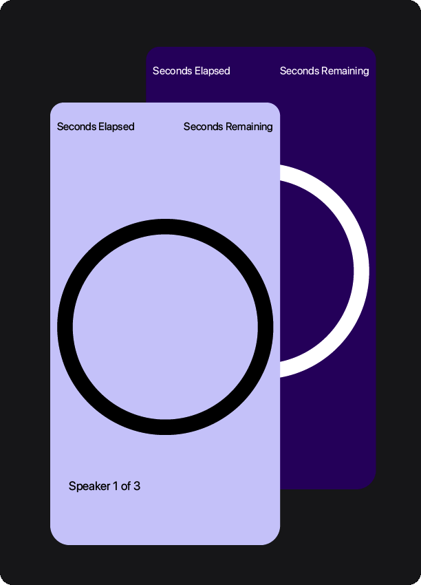
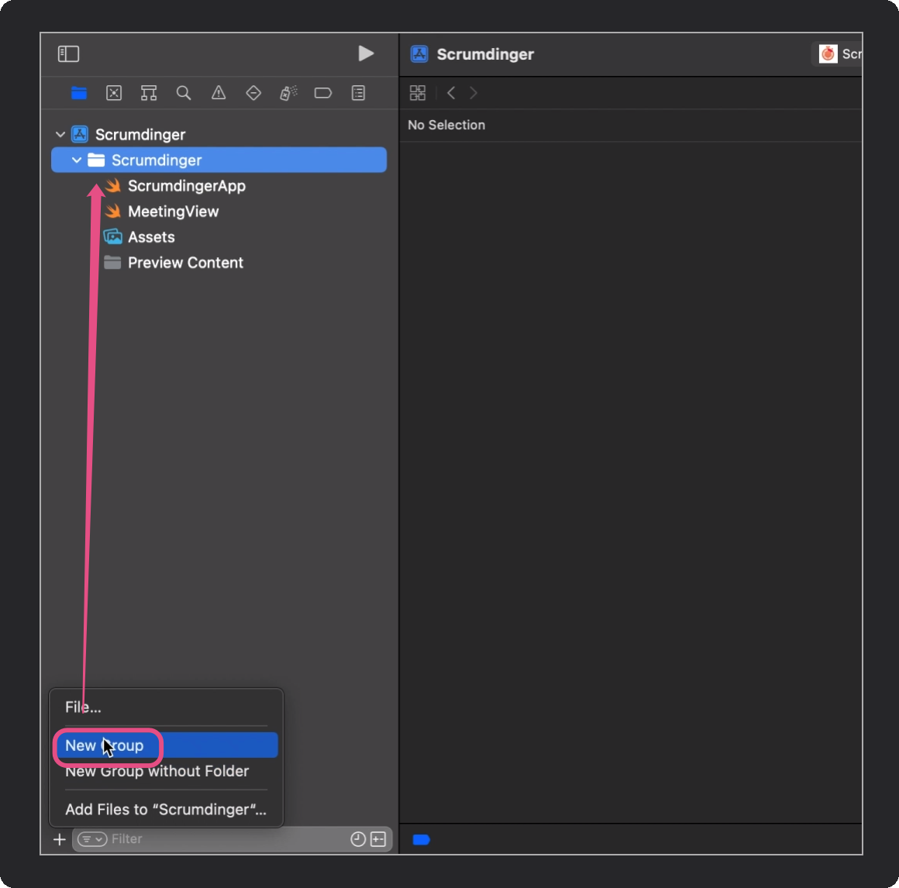
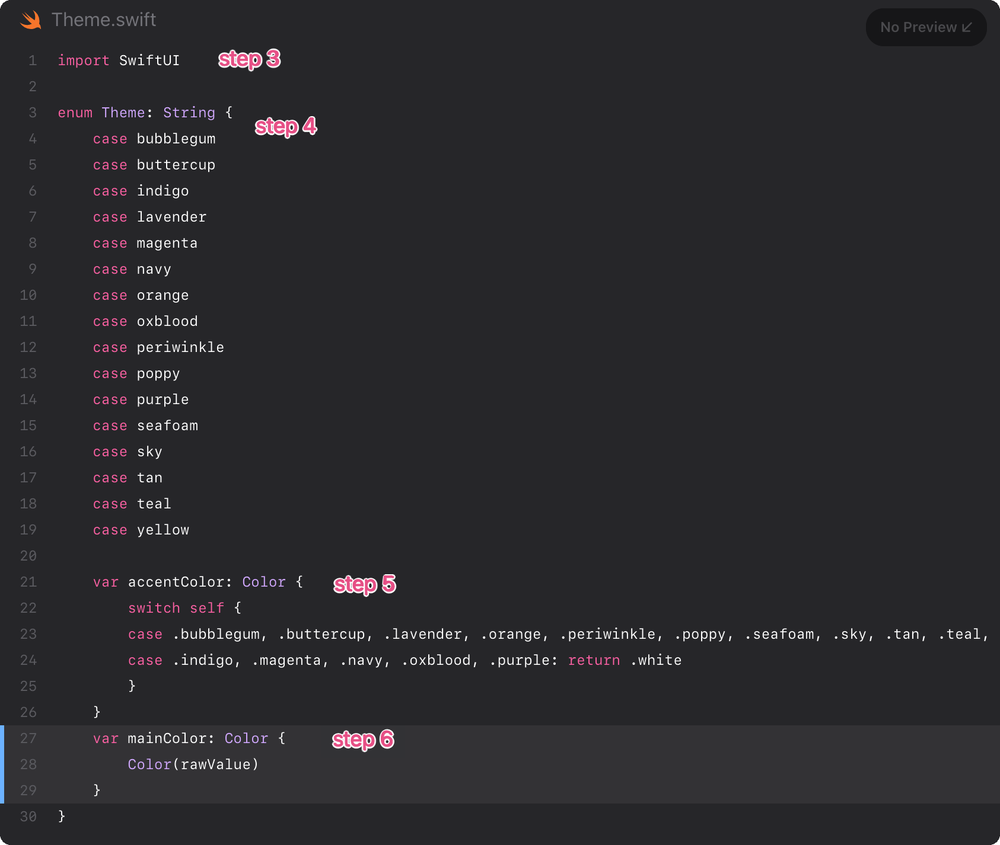
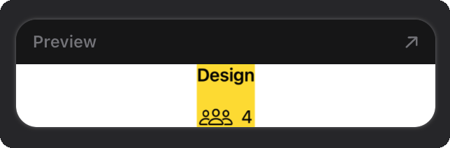
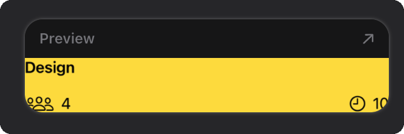
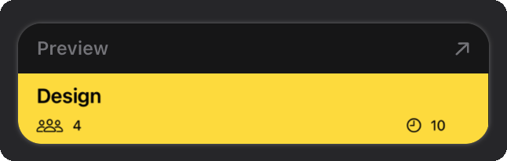
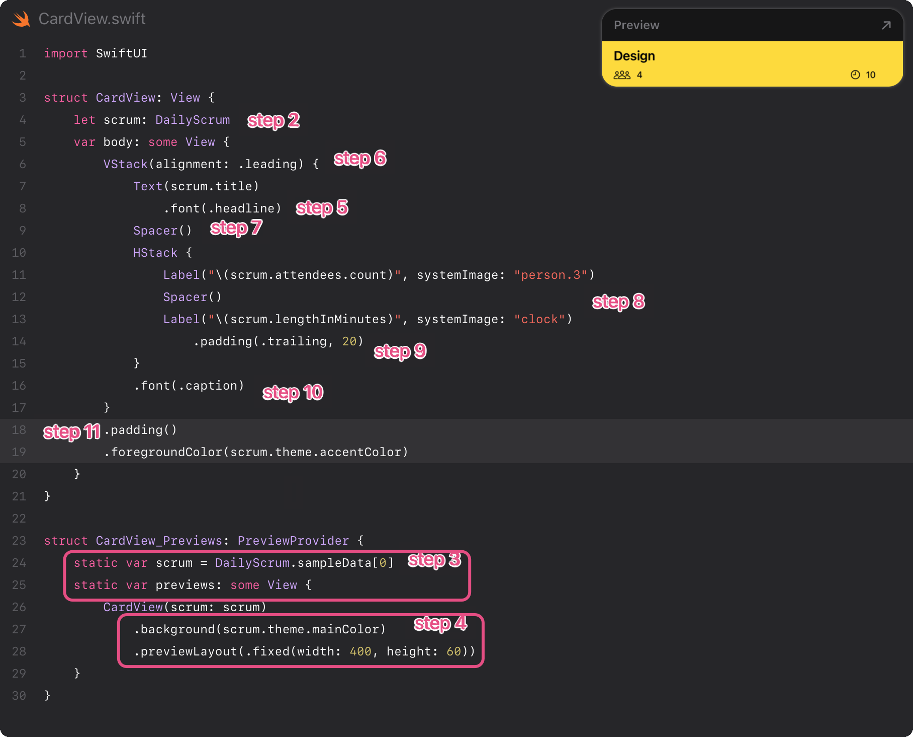
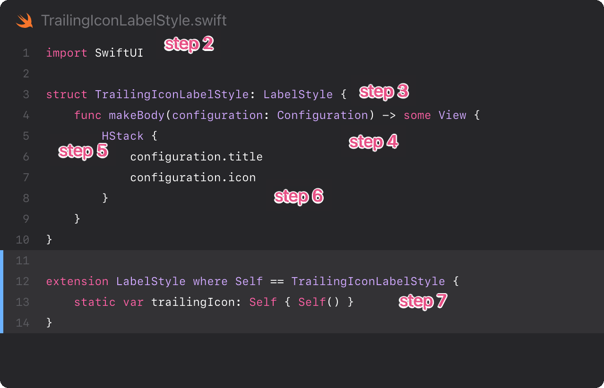
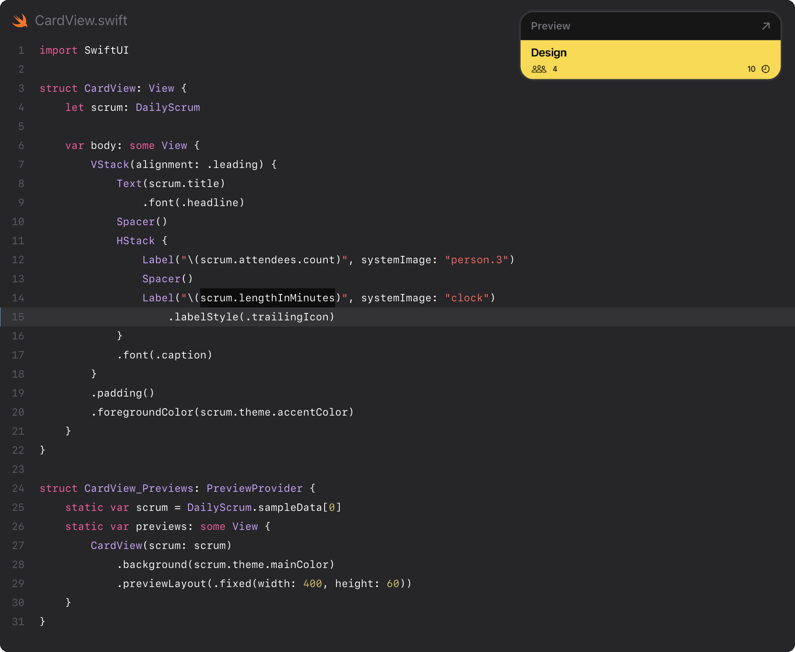

# 创建卡片视图

Scrumdinger 保留用户参加的每日站会列表，并在其根视图中显示该列表。

在本教程中，您将构建一个显示每日站会摘要的 CardView。 在下一个教程中，您将构建一个在列表的每一行中使用此 CardView 的列表视图。

下载起始项目并按照本教程进行操作，或者打开完成的项目并自行探索代码。

[项目代码](https://docs-assets.developer.apple.com/published/89d7e2a26a44afe4b2baad9343889049/CreatingACardView.zip)

## 第一部分 创建颜色主题

要在整个应用程序中创建一致的外观，您将创建一个具有两种对比色属性的主题: 为视图的背景使用主色，为视图的文本使用强调色。



1. 在项目导航器中创建一个新的分组 (文件夹) 命名为 `Models`
   
2. 在 `Models` 分组中创建文件 `Theme.swift`
3. 在 `Theme.swift` 中引用 SwiftUI. 虽然您没有在本节中创建视图，但您可以从 SwiftUI 框架添加 Color 属性。 SwiftUI 将颜色视为可以直接添加到视图层次结构中的视图实例。
4. 创建一个名为你 `Theme` 的枚举, 包含有一个 String 类型的值. 注意: 编译器会针对空的没有值的枚举抛出编译错误.
5. 为 Themes 文件夹中的各个颜色在枚举中添加 cases, 此处注意拼写, 不要匹配错误. 
6. 创建一个名为 `accentColor` 的 `Color` 属性, 根据 `self` 的情况返回 `.black` 或者 `.white`
7. 创建一个名为 `mainColor` 的 `Color` 属性, 使用枚举的原始值 (rawValue) 来创建颜色



## 第二部分 创建 Daily Scrum 模型

DailyScrum 模型将包含以下四个属性，所有属性都具有简单的值类型：title、attendees、lengthInMinutes 和 theme。 因为 DailyScrum 将主要承载值数据，所以您可以通过将其声明为结构体来使其成为值类型。

1. 在 `Models` 分组中添加一个 `DailyScrum.swift` 
2. 创建一个名为 `DailyScrum` 的结构体, 包含 `title` / `attendees` / `lengthInMinutes` / `theme` 四个属性
3. 创建一个扩展来为 `DailyScrum` 增加一些简单数据

```swift
import Foundation

// step 2
struct DailyScrum { 
    var title: String
    var attendees: [String]
    var lengthInMinutes: Int
    var theme: Theme
}

// step 3
extension DailyScrum {
    static let sampleData: [DailyScrum] =
    [
        DailyScrum(title: "Design", attendees: ["Cathy", "Daisy", "Simon", "Jonathan"], lengthInMinutes: 10, theme: .yellow),
        DailyScrum(title: "App Dev", attendees: ["Katie", "Gray", "Euna", "Luis", "Darla"], lengthInMinutes: 5, theme: .orange),
        DailyScrum(title: "Web Dev", attendees: ["Chella", "Chris", "Christina", "Eden", "Karla", "Lindsey", "Aga", "Chad", "Jenn", "Sarah"], lengthInMinutes: 5, theme: .poppy)
    ]
}
```

## 第三部分 创建卡片视图

CardView 将汇总 DailyScrum 模型数据并显示标题、参与者人数和持续时间。 您将从较小的视图组成 CardView，每个视图在 DailyScrum 结构体中显示一条数据。

您将更新结构体 CardView_Previews，以便在开发视图时立即获得视觉反馈。

1. 添加一个新的 Swift View 文件 命名为 CardView
2. 添加一个名为 scrum 的 DailyScrum 类型的常量
3. 在 `CardView_Previews` 结构体里面增加一个静态变量名叫 `scrum` 并把它传递给 `CardView` 的构造器
4. 通过使用 `scrum.theme.mainColor` 来设定 `CardView` 的 `background` 颜色, 并且使用 `previewLayout` 修饰器来设定预览的尺寸. 后面我们会把这个 `CardView` 嵌入到 `CardList` 里面
5. 给 text view 增加字体 `.headline` 的修饰
6. 把 text view 嵌入一个 VStack, 增加 `alignment: .leading` 的左对齐修饰
7. 使用 `spcacer` 来区隔 label 和添加的一堆人的图标, 注意`Label` 和 `Image` 方法的区别: `Image(systemName:_)`, `Label(_:systemImage:)`
   
8. 在人数图标和时间图标之间增加一个 spacer, 然后是时间图标
   
9. 将时间的图标向左缩进 20 点
10. 把整个 HStack 的文字设定为 `.caption` 的大小
11. 给整个 VStack 设定一个缩进 (padding), 并且用 `scrum.theme.accentColor` 来设定这个 VStack 的 `foregroundColor`, 可以看到效果拔群.
    


## 第四部分 自定义标签 (label) 样式

接下来准备自定义 label 的样式, 来水平组织 scrum 会议长度和表的图标, 需要使用 `LabelStyle` 这个 protocol 来实现, 便于后续重用



1. 创建一个文件 TrailingIconLabelStyle.swift
2. 引入 SwiftUI
3. 创建一个新的结构体名为 `TrailingIconLabelStyle`, 类型是 `LabelStyle`
4. 结构体里面定义一个方法 `makeBody(configuration:)`, 这个方法会在这个这个类型的 label 被渲染的时候调用
5. 在方法里面添加一个 HStack
6. 在 HStack 里面增加 `configuration.title` 和`configuration.icon`
7. 给 `LabelStyle` 在具体类型等于 `TrailingIconLabelStyle` 的时候增加一个扩展: 静态变量 `trailingIcon`
8. 在 `CardView.swfit` 文件中, 将 `scrum.lengthInMinutes` 的 padding 替换为新的 style 定义 
   

## 第五部分 给 card view 增加辅助访问

现在 CardView 已可视化布局，您将使所有用户都可以访问它。 您将向视图添加辅助功能修饰符，以便更轻松地理解和导航 VoiceOver 中的界面。

CardView 包含一个带有时钟图像的标签和一个表示会议时长的数字。 它还包含一张人像和一些与会者。

您将添加使用字符串插值的辅助功能标签，以便标签成为对视图有意义的描述。 VoiceOver 将读出“4 名与会者”和“10 分钟会议”。